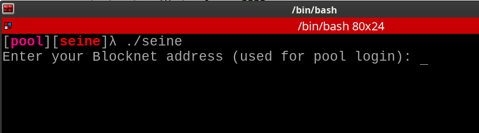
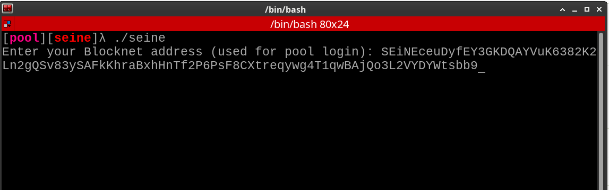
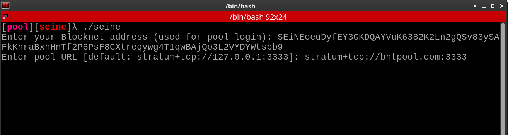

# seine

External miner for Blocknet with pluggable CPU and NVIDIA GPU backends.


## Quick Start

### 1. Optional: Install and sync Blocknet (daemon mode only)

If this is your first time running daemon mode, use the wrapper-managed flow:

```bash
blocknet install latest
blocknet start mainnet
```

This creates or reuses the managed config under `~/.config/bnt`, starts the core,
and writes the API cookie under `~/.config/bnt/data/mainnet/api.cookie` unless
you override `data_dir` in the Blocknet config.

You will be prompted to set a wallet password if needed. Once the daemon starts,
wait for it to fully sync — you'll see `[sync] progress` messages reach 100%:


When sync is complete, type `exit` to shut down the daemon.

### 2. Run the miner

**Option A — Pre-built binary** (from [Releases](../../releases)):

```bash
# Download the binary for your platform, then:
./seine
```

The Windows release archive includes the CUDA 12.8.61 NVRTC runtime DLLs needed
by the NVIDIA backend. An up-to-date NVIDIA display driver is still required;
no separate CUDA Toolkit installation or `PATH` change should be necessary for
the pre-built archive.

Tagged release archives also include the Seine license, this README, and an
internal checksum manifest. The GitHub release publishes a separate
`SHA256SUMS.txt` covering every platform archive.

**Option B — Build from source:**

```bash
cargo build --release
./target/release/seine
```

### Zero-argument mode (recommended)

Running `./seine` with no flags is the default path.
Default mode is **pool**.

First startup behavior:
- prompts for your Blocknet address
- prompts for pool URL (defaults to `stratum+tcp://bntpool.com:3333`)
- mining backends (CPU + NVIDIA when available)
- CPU thread count from available cores and RAM

#### First-run pool setup (visual)

1. Enter your Blocknet payout address when prompted.



2. Confirm the address prompt is filled before continuing.



3. Enter your pool endpoint and worker, then start mining.



These values are cached in:
- `./seine-data/seine.config.json` by default (`--data-dir` changes the base directory)

```bash
# Force daemon mode explicitly; wrapper-managed installs need no daemon args
./seine --mode daemon

# Override pool endpoint and worker in pool mode
./seine --pool-url stratum+tcp://pool.example.com:3333 --pool-worker rig-01
```

Full CLI reference: [`docs/MINER_FLAGS.md`](docs/MINER_FLAGS.md)

## Requirements

| Platform | CPU | GPU (NVIDIA) |
|----------|-----|--------------|
| Linux x86_64 | works out of the box | CUDA driver + NVRTC libs |
| macOS x86_64 | works out of the box | — |
| macOS ARM | works out of the box (Metal experimental) | — |
| Windows x86_64 | works out of the box | CUDA driver + NVRTC libs |

Each CPU thread needs ~2 GB RAM (Argon2id parameters). Seine auto-sizes thread count from available cores and memory.
On x86_64, CPU builds include both AVX2 and AVX-512 kernels and dispatch at runtime when the host supports them.

## Linux HugePages (CPU Throughput)

For best CPU mining performance on Linux, reserve explicit HugeTLB pages so each worker can map its Argon2 arena with `MAP_HUGETLB` (the backend falls back to THP if unavailable, which is often slower/inconsistent under fragmentation).

- Sizing rule (2 MB hugepages): `nr_hugepages ~= threads * 1024`
- Each CPU worker needs about `2 GiB` of hugepages (`1024 * 2 MB`)
- Add small headroom if possible (for example `+5%`)

Example for `--threads 4`:

```bash
# 4 workers * 1024 pages/worker = 4096 hugepages (~8 GiB)
sudo sysctl -w vm.nr_hugepages=4096
```

If the kernel cannot allocate enough pages (fragmented memory), compact and retry:

```bash
echo 3 | sudo tee /proc/sys/vm/drop_caches
echo 1 | sudo tee /proc/sys/vm/compact_memory
sudo sysctl -w vm.nr_hugepages=4096
```

Verify reservation:

```bash
grep -E 'HugePages_Total|HugePages_Free|Hugepagesize' /proc/meminfo
```

Persist across reboots:

```bash
echo 'vm.nr_hugepages=4096' | sudo tee /etc/sysctl.d/99-seine-hugepages.conf
sudo sysctl --system
```

If a runtime `sysctl -w vm.nr_hugepages=...` request only allocates a fraction of
the target, keep the value persisted and reboot. Early-boot reservation is much
more reliable than trying to carve out tens of GiB of HugeTLB pages after the
machine is already fragmented.

Runtime checks:
- Startup warns with exact sizing/commands when HugeTLB is under-provisioned (`hugepages | CPU lanes=... need ...`).
- Per-backend fallback warnings still appear if a worker falls back from `MAP_HUGETLB` (`MAP_HUGETLB unavailable; hugepage coverage...`).
- `--cpu-page-mode large` requires every CPU worker to receive `MAP_HUGETLB` and fails CPU backend startup instead of mixing page classes or silently falling back.
- `--cpu-page-mode large-1g` does the same with explicit 1 GiB pages (`MAP_HUGETLB|MAP_HUGE_1GB`, x86_64 Linux/WSL only); see "WSL/Linux HugeTLB provisioning" below for reserving the 1 GiB pool.
- `--cpu-page-mode regular` disables THP for a controlled base-page benchmark. The default `auto` mode retains the production fallback chain.
- Benchmark reports record measured HugeTLB, THP, regular-page, and heap bytes per CPU backend so page-backed runs can be verified rather than inferred.
- In practice, once many CPU lanes are active, hugepage coverage usually matters more than ISA-level tuning for backend throughput.

## Windows Large Pages

Native Windows CPU workers first try `VirtualAlloc` with large pages, then safely
fall back to regular `VirtualAlloc` pages. Large-page use requires the mining
account to hold **Lock pages in memory** (`SeLockMemoryPrivilege`); changing that
user right normally requires signing out and back in before a process can enable
it. Seine never grants the right or triggers a sign-out itself, and logs the Win32
fallback reason so benchmark manifests remain interpretable.

Use `--cpu-page-mode large` after granting the right to require large pages for
every worker, or `--cpu-page-mode regular` for a matched ordinary-page control.
Required-large startup fails with the Win32 allocation error if the privilege or
enough large-page memory is unavailable. The Linux-only `large-1g` mode is
rejected on Windows. macOS supports `auto` and `regular`; explicit `large` and
`large-1g` modes are rejected because there is no equivalent allocator contract.

Native Windows `--cpu-affinity auto` also uses complete processor-core topology
groups before SMT siblings. If Windows returns incomplete or contradictory
topology data, Seine retains the original logical-CPU order.

### WSL/Linux HugeTLB provisioning

`--cpu-page-mode large` uses only a pre-reserved HugeTLB pool on Linux/WSL and
fails closed when the full arena set is unavailable. Each CPU worker needs 1024
two-MiB huge pages. A practical reservation with 5% headroom is:

```text
vm.nr_hugepages = ceil(cpu_threads * 1024 * 1.05)
```

For nine workers, reserve `9677` pages (about 18.9 GiB) before memory becomes
fragmented, for example in `/etc/sysctl.d/99-seine-hugepages.conf`:

```text
vm.nr_hugepages = 9677
```

`--cpu-page-mode large-1g` is the 1 GiB variant (x86_64 Linux/WSL only): every
worker arena is mapped with `MAP_HUGETLB|MAP_HUGE_1GB` from the explicit 1 GiB
pool and startup fails closed on any shortfall. Each 2 GiB worker arena needs
exactly two 1 GiB pages, so no fractional headroom is required:

```bash
# 9 workers * 2 pages/worker = 18 x 1 GiB pages
echo 18 | sudo tee /sys/kernel/mm/hugepages/hugepages-1048576kB/nr_hugepages
```

1 GiB pages usually cannot be assembled after boot on a fragmented host; prefer
reserving them at boot with the `hugepagesz=1G hugepages=18` kernel parameters.
On WSL2 set them in `%UserProfile%\.wslconfig`, e.g.
`kernelCommandLine = hugepagesz=1G hugepages=18`, then restart WSL. Verify the
pool with `cat /sys/kernel/mm/hugepages/hugepages-1048576kB/free_hugepages`
(the `HugePages_*` lines in `/proc/meminfo` cover only the default 2 MiB size).
Benchmark telemetry reports 1 GiB backing separately (`large1g=`/`large1g_bytes=`),
and `scripts/bench_cpu_ab.sh --page-mode large-1g` rejects any run that fell
back or mixed page classes.

On WSL2, the VM must also have enough ordinary headroom for Windows/WSL services.
The validated 64-GiB host used `%UserProfile%\.wslconfig` with `memory=48GB`,
`processors=32`, and `swap=8GB`. Restart WSL only when convenient, then verify
`HugePages_Free` can cover every requested arena before mining. This reservation
is unavailable to ordinary applications until reduced; size it for the profile
you actually run.

## Configuration

All miner flags are documented in [`docs/MINER_FLAGS.md`](docs/MINER_FLAGS.md).

```bash
# Set CPU thread count explicitly
./seine --threads 4

# Force a specific backend (auto-detects by default)
./seine --backend cpu
./seine --backend nvidia
./seine --backend cpu,nvidia

# Wallet password (if wallet is encrypted)
./seine --wallet-password-file /path/to/wallet.pass

# Pool mode controls
./seine --address PpkFxY...
./seine --pool-url stratum+tcp://pool.example.com:3333
./seine --pool-worker rig-01

# Force daemon mode with wrapper-managed autodiscovery
./seine --mode daemon

# Custom direct-core layout override
./seine --mode daemon --api-url http://127.0.0.1:8332 --cookie /path/to/api.cookie

# Plain log output instead of TUI
./seine --ui plain
```

Note: in daemon mode, when `--address` matches the daemon wallet address, Seine keeps wallet pending/unlocked stats in the TUI. If it differs, TUI balance fields show `---` for the override address.

In pool mode, Seine now also checks for a local daemon when daemon auth is available. If one responds, the TUI wallet panel keeps the pool balance and also shows the local daemon wallet balance.

## Control API

Seine now supports a local control API for alternative frontends.
Full API docs: [`docs/API.md`](docs/API.md)

### Service mode (idle until API start)

```bash
./seine --service --api-bind 127.0.0.1:9977
```

Then start mining via API:

```bash
curl -s -X POST http://127.0.0.1:9977/v1/miner/start \
  -H 'content-type: application/json' \
  -d '{
    "mode":"pool",
    "mining_address":"PpkFxY...",
    "pool_url":"stratum+tcp://pool.example.com:3333",
    "pool_worker":"rig-01"
  }'
```

### Embedded mode (mine immediately + expose API)

```bash
./seine --api-server --api-bind 127.0.0.1:9977
```

`/v1/miner/start` accepts mode-specific fields (`mode`, `pool_url`, `pool_worker`, `mining_address`) plus optional daemon auth fields (`token` or `cookie_path`). In pool mode, daemon auth enables local daemon wallet balance alongside pool figures when a daemon is available.

Key endpoints:
- `GET /v1/runtime/state`
- `POST /v1/miner/start`
- `POST /v1/miner/stop`
- `GET /v1/events/stream` (SSE)
- `GET /metrics`

Control API endpoints are open by default; no API key is required.

Password sources (checked in order): `--wallet-password`, `--wallet-password-file`, `SEINE_WALLET_PASSWORD` env var, interactive prompt.

## GPU Mining

### Apple Silicon CPU guidance

Apple Silicon defaults to CPU-only mining; Metal remains explicit opt-in. On the
48 GiB M4 Max validation host, the balanced 14-lane `pcore-only` policy averaged
`29.26 H/s` and beat 14-lane `auto` by `0.94%` in three paired runs (95% paired
bootstrap interval `-1.22%` to `-0.45%` for `auto`). For a dedicated maximum-rate
run, 16-lane `auto` reached `30.94 H/s`, but the 32 GiB arena set caused macOS to
create and use roughly 3 GiB of swap. Treat that as a throughput setting, not a
general balanced default.

An exact-binary 13-versus-14 follow-up measured 14 lanes **2.57% faster** (95%
paired interval `+1.91%` to `+2.92%`, all three pairs faster). CPU autotuning now
confirms close balanced-profile finalists with longer reversed-order samples so
a noisy first-run scan does not cache the slower 13-lane choice.

Examples:

```bash
# Balanced on a 48 GiB 12P+4E M4 Max
./seine --backend cpu --threads 14 --cpu-affinity pcore-only

# Maximum observed rate; expect much higher memory pressure
./seine --backend cpu --threads 16 --cpu-affinity auto
```

On macOS, affinity values are Mach scheduler tags plus a high-QoS preference;
they are not hard CPU-ID pinning.

### NVIDIA

Requires CUDA driver and NVRTC libraries on the host. Seine compiles kernels at startup via NVRTC.
The current Windows build uses cudarc's CUDA 12.8 loader feature, so a Windows
machine with only CUDA 13.x-style DLL names (for example `nvrtc64_130_0.dll`)
will not be discovered. Official Windows release archives bundle the required
12.8.61 NVRTC DLLs beside Seine. Source builds can install the CUDA 12.8 NVRTC
redistributable separately or add its `bin` directory to `PATH`.

Current Blackwell / RTX 5090 tuning notes and measured benchmark frontier:
[`docs/NVIDIA_5090_TUNING.md`](docs/NVIDIA_5090_TUNING.md)

```bash
# Auto-detect all GPUs
./seine --backend nvidia

# Select specific devices
./seine --backend nvidia --nvidia-devices 0,1
```

If CUDA initialization fails, NVIDIA backends are quarantined and CPU mining continues.

### Metal (macOS ARM)

Metal support is experimental and is not auto-selected. The M4 Max CPU-only path
substantially outperformed Metal-only and CPU+Metal tests because both processors
compete for unified memory bandwidth. Pre-built macOS ARM binaries include Metal
for explicit experiments. To build from source:

```bash
cargo build --release --no-default-features --features metal
```

## Building from Source

Requires [Rust](https://rustup.rs/) and GNU Make.

Using Make:

```bash
# Default build (includes NVIDIA support)
make

# CPU-only build (no CUDA dependency)
make build-cpu

# Host-native CPU build (optimized for your specific CPU)
make build-native

# Run tests
make test

# Package a release zip for current platform
make release

# Bump Cargo version + create matching git tag
make tag-release TAG=v0.1.10
```

Or directly with Cargo:

```bash
# Default build (includes NVIDIA support)
cargo build --release

# CPU-only build (no CUDA dependency)
cargo build --release --no-default-features

# Host-native CPU build (optimized for your specific CPU)
./scripts/build_cpu_native.sh --cpu-only
```

On dedicated local x86_64 miners, `build-native` can still provide a small extra backend uplift on top of runtime AVX2/AVX-512 dispatch.

## Benchmarking

Run offline benchmarks without a daemon connection:

```bash
./seine --bench --bench-kind backend --backend cpu --threads 1 --bench-secs 20 --bench-rounds 3
```

## Further Reading

- [AGENTS.md](AGENTS.md) — Architecture details, tuning knobs, benchmarking harness
- [docs/MINER_FLAGS.md](docs/MINER_FLAGS.md) — Complete CLI flag reference
- [docs/API.md](docs/API.md) — Control API guide (REST, SSE, metrics)
- [docs/openapi/seine-api-v1.yaml](docs/openapi/seine-api-v1.yaml) — OpenAPI specification
- [CPU_OPTIMIZATION_LOG.md](CPU_OPTIMIZATION_LOG.md) — CPU backend tuning history
- [NVIDIA_OPTIMIZATION_LOG.md](NVIDIA_OPTIMIZATION_LOG.md) — NVIDIA backend tuning history
